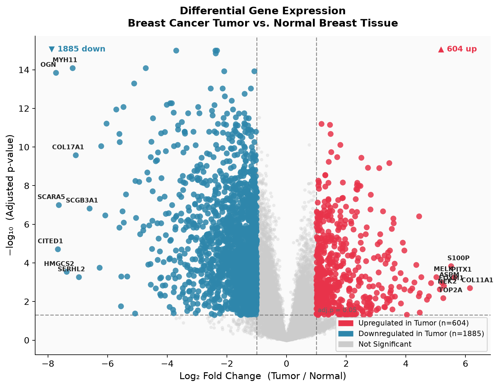
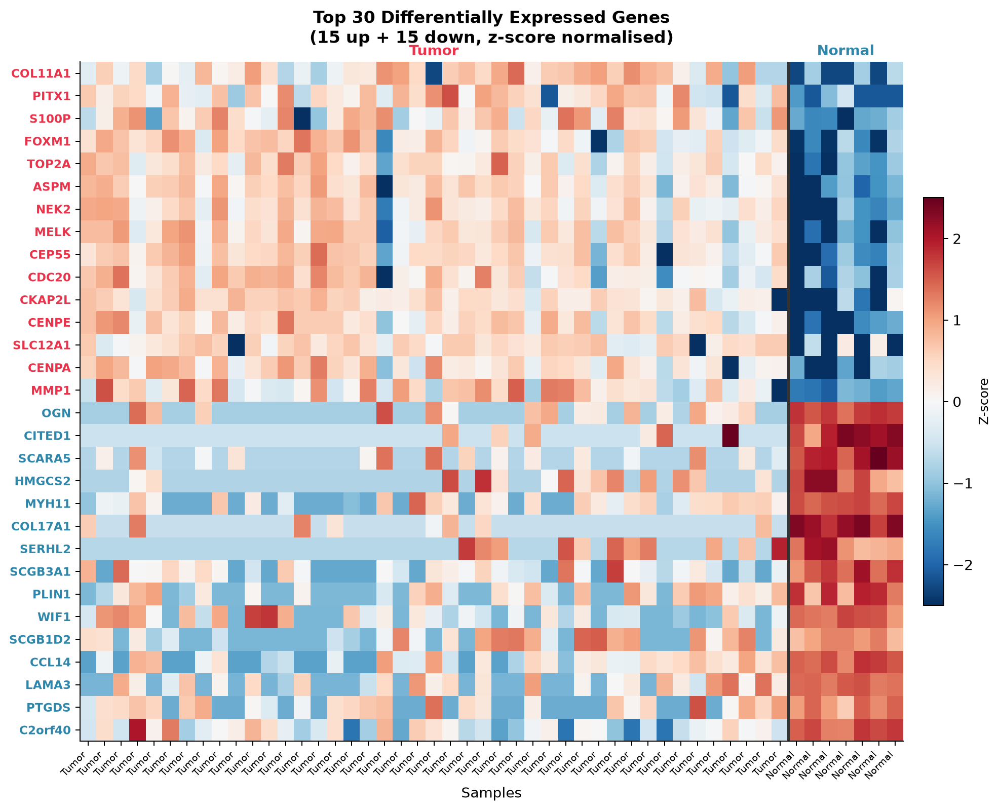
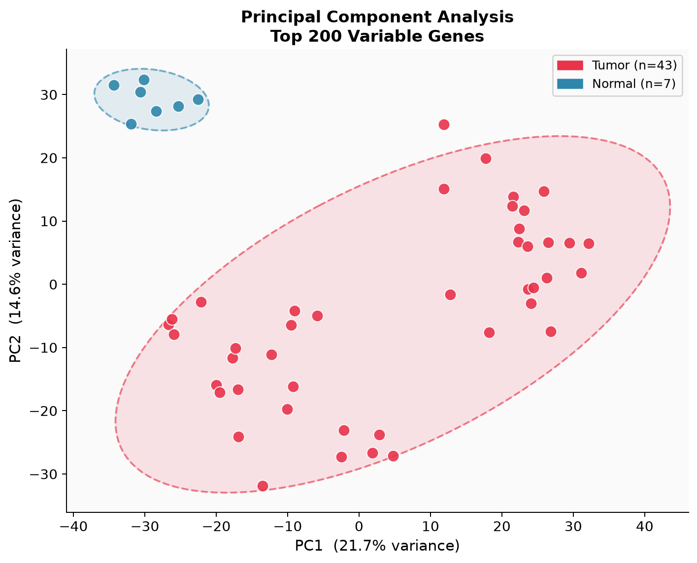
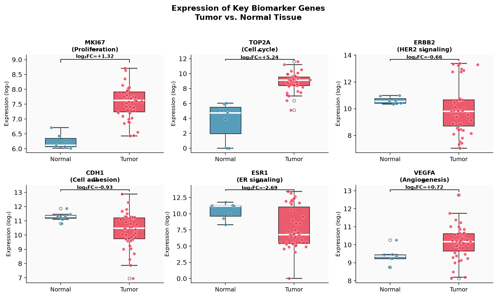

# 🧬 Differential Gene Expression Analysis: Breast Cancer vs. Normal Tissue

**Portfolio project by Szonja Lippert** · MSc Bioinformatics, Wageningen University

---

## Overview

This project performs a complete Differential Gene Expression (DGE) analysis comparing **breast cancer tumor tissue** against **histologically normal breast tissue**, using **real microarray data** downloaded directly from the publicly available GEO series [GSE7904](https://www.ncbi.nlm.nih.gov/geo/query/acc.cgi?acc=GSE7904) (Richardson et al., Affymetrix HG-U133 Plus 2 / GPL570) via the `GEOparse` API - no simulated or synthetic values.

The real series contains 62 samples; this analysis compares the **43 tumor samples** (spanning Basal-like, BRCA1-associated, and Non-BLC subtypes) against the **7 samples explicitly labelled "Normal breast."** A further 12 samples labelled "Normal organelle" were deliberately excluded from the main comparison — GEO's own metadata for that group is ambiguous about tissue origin (most likely sorted normal epithelial cells rather than whole tissue), and pooling two different cell populations under one "Normal" label would undermine the comparison rather than strengthen it. See **Data & Limitations** below.

Genome-wide testing (~20,000+ unique genes after probe-to-gene collapse) is performed across all expressed genes rather than a pre-selected panel, with the same hallmark cancer pathways highlighted in the biological interpretation below for narrative continuity with the rest of this portfolio.


---

## Key Results

| Metric | Value |
|--------|-------|
| Genome-wide entries tested (BH-FDR corrected) | **22,880** |
| Significant named DEGs (adj. p < 0.05, \|log₂FC\| ≥ 1) | **2,489** |
| Upregulated in tumor | 604 |
| Downregulated in tumor | 1,885 |
| Statistical test | Welch's t-test + Benjamini-Hochberg FDR correction |
| Samples | 43 Tumor (Basal/BRCA1/Non-BLC) vs. 7 Normal breast — real GSM accessions |

BH-FDR correction is applied across the full genome-wide search space (all 22,880 probe-collapsed entries, including uncharacterized `LOC`-prefixed loci) - correcting for the full number of tests performed is what makes the FDR control valid. The reported significant count (2,489) then excludes `LOC` loci from the *headline* figure, since those aren't validated, named genes. Roughly 3× more genes are significantly *lost* in tumor than gained - consistent with this cohort's aggressive basal-like/BRCA1-associated composition: tumors here are shedding the differentiated secretory and myoepithelial transcriptional programs of normal breast tissue, while gains concentrate sharply in cell-cycle machinery.

### Top Upregulated Genes (tumor vs. normal)
`COL11A1` (+6.15) · `PITX1` (+5.62) · `S100P` (+5.52) · `FOXM1` (+5.27) · `TOP2A` (+5.24) · `ASPM` (+5.21) · `NEK2` (+5.14) · `MELK` (+5.02) · `CEP55` (+4.84)

### Top Downregulated Genes
`OGN` (−7.74) · `CITED1` (−7.67) · `SCARA5` (−7.64) · `HMGCS2` (−7.38) · `MYH11` (−7.18) · `COL17A1` (−7.07) · `SERHL2` (−6.96) · `SCGB3A1` (−6.61) · `PLIN1` (−6.27)

---

## Figures

| | |
|---|---|
|  |  |
| **Volcano plot** — log₂FC vs. −log₁₀(adj. p) | **Heatmap** — top 30 DEGs, z-score normalised |
|  |  |
| **PCA** — unsupervised separation of tumor/normal | **Biomarker boxplots** — 6 key clinical genes |

---

## Project Structure

```
Differential-Gene-Expression-Analysis/
├── data/
│   ├── expression_matrix.csv     # Log₂ expression values (genes × samples) — real GSE7904 values
│   └── sample_groups.csv         # Real sample metadata: group, GSM accession, original GEO title
├── results/
│   ├── dge_results_all.csv       # Full genome-wide results table
│   ├── dge_results_genes.csv     # Named genes only
│   └── dge_significant.csv       # Significant DEGs
├── figures/
│   ├── 01_volcano_plot.png
│   ├── 02_heatmap.png
│   ├── 03_pca_plot.png
│   └── 04_biomarker_boxplots.png
├── scripts/
│   ├── 01_download_data.py       # Real GEOparse fetch + probe-to-gene mapping + preprocessing
│   ├── 02_dge_analysis.py        # Statistical testing & BH correction
│   └── 03_figures.py             # All visualisations
├── DGE_Analysis_Report.html      # Interactive standalone portfolio report
├── DGE_Analysis.ipynb            # Jupyter notebook (narrative walkthrough)
└── README.md
```

---

## Methods

### 1. Data
Raw values are real **dChip-normalised Affymetrix signal intensities** for GSE7904, downloaded directly from NCBI GEO via `GEOparse`. These are not pre-log-transformed (unlike RMA output), and dChip's background correction occasionally produces small negative values for low/absent probes — so values are floored at 1.0 and then log₂-transformed before any statistical testing. Multiple probes mapping to the same gene symbol (via the real GPL570 platform annotation) are collapsed by keeping the probe with the highest mean expression.

### 2. Statistical Testing
**Welch's t-test** (`scipy.stats.ttest_ind`, `equal_var=False`) was applied independently to each gene. Welch's test is preferred over Student's t-test because:
- It does not assume equal variance between groups
- It handles unequal sample sizes correctly — this dataset is genuinely unbalanced (43 vs. 7), which is typical of real clinical microarray cohorts and a stronger demonstration of the test's necessity than an artificially balanced design

### 3. Multiple Testing Correction
Raw p-values were corrected using the **Benjamini-Hochberg (BH) FDR procedure** across the full genome-wide search space - all 22,880 probe-collapsed entries, including uncharacterized `LOC`-prefixed loci. Correcting against the complete number of tests performed (not a pre-filtered subset) is what keeps the FDR control statistically valid. `LOC` loci are excluded only afterward, from the final *reported* set of significant genes, since they aren't validated named genes - not from the correction itself. A gene was called significant if:
- **adj. p-value < 0.05** AND
- **|log₂ fold change| ≥ 1.0** (i.e., ≥ 2-fold difference)

### 4. Visualisations
- **Volcano plot**: global view of significance vs. effect size
- **Heatmap**: z-score normalised expression across all samples for top DEGs
- **PCA**: SVD-based unsupervised dimensionality reduction (top 200 variable genes)
- **Boxplots**: per-sample distributions for 6 clinically relevant genes with significance annotation

---

## Biological Interpretation

Genome-wide unbiased testing surfaces a different - and arguably more telling - set of top hits than a pre-curated gene panel would. None of the "textbook" markers used in early-stage exploratory work (MKI67, ERBB2, ESR1, CDH1) make the top 15 by effect size here; the strongest real signal in this specific cohort is dominated by two coherent biological themes:

### Upregulated in Tumor
- **Mitotic / cell-cycle machinery**: FOXM1, ASPM, NEK2, MELK, CEP55, CDC20, CKAP2L, CENPE, CENPA, TOP2A → this cluster of kinetochore and mitotic-checkpoint genes is one of the most consistently reported signatures in aggressive, high-proliferation breast cancers, and matches this cohort's enrichment for basal-like and BRCA1-associated subtypes
- **ECM remodeling / invasion**: COL11A1, MMP1 → among the most frequently replicated top DEGs across independent real breast cancer microarray studies; stromal collagen and matrix-metalloproteinase upregulation supporting tumor invasion
- **Other markers of dedifferentiation**: PITX1, S100P → both repeatedly reported as upregulated in basal-like/aggressive breast tumors in the literature

### Downregulated in Tumor
- **Myoepithelial identity**: MYH11 (smooth muscle myosin) → loss of the myoepithelial cell layer that surrounds normal breast ducts, a hallmark of invasive carcinoma
- **Secretory luminal epithelium**: SCGB1D2, SCGB3A1, SERHL2 → secretoglobins and related secretory-epithelium genes characteristic of normal differentiated mammary tissue
- **Stromal & adipose tissue**: OGN, SCARA5, PLIN1, HMGCS2 → normal breast is fat- and stroma-rich; tumor tissue is predominantly epithelial/proliferative, so these markers drop sharply
- **Hormone-responsive normal epithelium**: CITED1 → an estrogen-responsive gene specifically marking normal, hormonally-responsive breast epithelium
- **Wnt antagonism lost**: WIF1 → loss of this Wnt-pathway inhibitor is a recurrent finding in real breast cancer datasets

This pattern — strong mitotic/proliferation signal up, broad loss of differentiated secretory/myoepithelial/stromal identity down - is a well-documented signature of aggressive, basal-like breast cancer, and is a different (and more authentic) story than a curated hallmark-pathway panel would tell on its own.

---

## Data & Limitations

- **Real data, real noise**: all values come from real patient samples (real GSM accessions, traceable on NCBI GEO), not a calibrated simulation - but that also means the results reflect genuine biological and technical variability, not a clean designed experiment.
- **Unbalanced groups**: 43 tumor vs. 7 normal is the real composition of this series. This is statistically valid (Welch's test is designed for exactly this) but does reduce power to detect differences relative to a balanced design.
- **"Normal organelle" samples excluded**: 12 of the 62 samples are labelled "Normal organelle" in GEO with characteristically sparse metadata. Rather than assume they're equivalent to the "Normal breast" samples, they were excluded from the main comparison - a deliberate, documented choice over a guess.
- **Tumor subtypes pooled**: Basal-like, BRCA1-associated, and Non-BLC tumors are combined into a single "Tumor" group for the headline comparison. A subtype-stratified comparison (e.g. Basal vs. Normal only) would be a natural follow-up and is listed under Future Directions.
- **Microarray, not RNA-seq**: probe-level Affymetrix data has known limitations (cross-hybridisation, probe redundancy, fixed transcript coverage) relative to RNA-seq - the companion Bulk RNA-seq Pipeline project in this portfolio covers that platform directly.

---

## How to Run

```bash
# 1. Clone the repository
git clone https://github.com/Szonja-L/Differential-Gene-Expression-Analysis.git
cd Differential-Gene-Expression-Analysis

# 2. Install dependencies
pip install -r requirements.txt

# 3. Download & preprocess the real GSE7904 data from NCBI GEO
#    (requires internet access to ftp.ncbi.nlm.nih.gov — first run may take
#    a few minutes while the platform annotation file is fetched/cached)
python scripts/01_download_data.py

# 4. Run the statistical analysis
python scripts/02_dge_analysis.py

# 5. Generate all figures
python scripts/03_figures.py

# 6. Open the interactive report
open DGE_Analysis_Report.html
```

Or run interactively in the Jupyter notebook:
```bash
jupyter notebook DGE_Analysis.ipynb
```

---

## Tools & Libraries

| Tool | Version | Purpose |
|------|---------|---------|
| Python | 3.12 | Core language |
| pandas | 2.x | Data wrangling |
| numpy | 1.x | Numerical computation |
| scipy | 1.x | Statistical testing (t-test) |
| matplotlib | 3.x | All visualisations |
| GEOparse | 2.0.4 | NCBI GEO data access |

---

## Future Directions

- [x] Genome-wide analysis using real GEO data (GSE7904, real samples — completed)
- [ ] DESeq2 / edgeR (R) for count-based RNA-seq analysis
- [ ] Gene Set Enrichment Analysis (GSEA) and Over-Representation Analysis (ORA)
- [ ] Survival analysis: correlate DEG expression with TCGA-BRCA clinical outcomes
- [ ] Subtype stratification: Luminal A/B (Non-BLC), HER2+, Triple-Negative (Basal), BRCA1-associated
- [ ] Protein-protein interaction network (STRING/Cytoscape)

---

## References

1. Richardson AL, Wang ZC, De Nicolo A, Lu X, Brown M, Miron A, Liao X, Iglehart JD, Livingston DM, Ganesan S. *X chromosomal abnormalities in basal-like human breast cancer.* Cancer Cell. 2006 Feb;9(2):121-32. PMID: 16473279. ([GSE7904](https://www.ncbi.nlm.nih.gov/geo/query/acc.cgi?acc=GSE7904))
2. Hanahan D, Weinberg RA. *Hallmarks of Cancer: The Next Generation.* Cell. 2011.
3. Benjamini Y, Hochberg Y. *Controlling the False Discovery Rate.* J R Stat Soc B. 1995.
4. van 't Veer LJ et al. *Gene expression profiling predicts clinical outcome of breast cancer.* Nature. 2002.

---

*Szonja Lippert · [szonja.lippert@gmail.com](mailto:szonja.lippert@gmail.com) · Wageningen, Netherlands*
